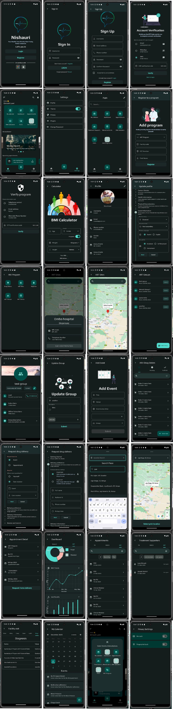

# nishauri


<picture>
  
</picture>


A new Flutter project.

## Getting Started

This project is a starting point for a Flutter application.

A few resources to get you started if this is your first Flutter project:

- [Lab: Write your first Flutter app](https://docs.flutter.dev/get-started/codelab)
- [Cookbook: Useful Flutter samples](https://docs.flutter.dev/cookbook)

For help getting started with Flutter development, view the
[online documentation](https://docs.flutter.dev/), which offers tutorials,
samples, guidance on mobile development, and a full API reference.

### Clean folder structure
```
lib/
├── app/
│   ├── app.dart
│   ├── app_router.dart
│   ├── app_theme.dart
│   └── main.dart
├── features/
│   ├── feature1/
│   │   ├── data/
│   │   │   ├── models/
│   │   │   ├── providers/
│   │   │   └── repositories/
│   │   ├── domain/
│   │   │   ├── entities/
│   │   │   ├── failures/
│   │   │   └── repositories/
│   │   └── presentation/
│   │       ├── pages/
│   │       └── widgets/
│   └── feature2/
│       ├── data/
│       │   ├── models/
│       │   ├── providers/
│       │   └── repositories/
│       ├── domain/
│       │   ├── entities/
│       │   ├── failures/
│       │   └── repositories/
│       └── presentation/
│           ├── pages/
│           └── widgets/
├── shared/
├── utils/
└── main.dart

```

Here is an explanation of each folder in the folder structure I provided:

- `lib`: This is the root directory of the Flutter project.
- `app`: This folder contains the main entry point of the application, including the `main` function, `App` widget, and `AppRouter`.
    - `app.dart`: This file contains the `App` widget, which is the root widget of the application.
    - `app_router.dart`: This file contains the `AppRouter` class, which is responsible for defining the application's routes.
    - `app_theme.dart`: This file contains the theme data for the application.
- `features`: This folder contains subfolders for each feature of the application, with each subfolder containing three subfolders: `data`, `domain`, and `presentation`.
    - `feature1`: This folder contains code related to feature1.
        - `data`: This folder contains code related to data management for feature1.
            - `models`: This folder contains data models used in feature1.
            - `providers`: This folder contains Riverpod providers used in feature1.
            - `repositories`: This folder contains repositories used in feature1.
        - `domain`: This folder contains code related to domain logic for feature1.
            - `entities`: This folder contains entities used in feature1.
            - `failures`: This folder contains failure classes used in feature1.
            - `repositories`: This folder contains repositories used in feature1.
        - `presentation`: This folder contains code related to UI presentation for feature1.
            - `pages`: This folder contains pages used in feature1.
            - `widgets`: This folder contains widgets used in feature1.
    - `feature2`: This folder contains code related to feature2. The contents of this folder are similar to those of the `feature1` folder.
- `shared`: This folder contains code that is shared across multiple features, such as utility functions or custom widgets.
- `utils`: This folder contains utility functions that are not specific to any feature.
- `main.dart`: This file contains the `main` function, which is the entry point of the application.
  Sure, I'd be happy to explain the different components of the folder structure I provided earlier.

**Models**: This folder contains data models that are used to represent data in your application. For example, if you have a user object that has a name and an email address, you might create a `User` model with `name` and `email` fields.

**Entities**: This folder contains entities that represent the core business logic of your application. Entities are objects that have an identity and are independent of the state of your application. For example, if you have a user object that has a name and an email address, you might create a `User` entity with `id`, `name`, and `email` fields.

**Failures**: This folder contains classes that represent errors or failures that can occur in your application. For example, if you have a network request that fails, you might create a `NetworkFailure` class to represent that failure.

**Repositories**: This folder contains classes that are responsible for managing data in your application. There are two types of repositories: domain repositories and data repositories.

- **Domain repositories** are responsible for managing entities in your application. They define methods for retrieving, updating, and deleting entities. For example, if you have a `User` entity, you might create a `UserRepository` with methods like `getUserById`, `updateUser`, and `deleteUser`.

- **Data repositories** are responsible for managing data sources in your application. They define methods for retrieving data from external sources like APIs or databases. For example, if you have a REST API that returns user data, you might create a `UserDataRepository` with methods like `getUserDataById`.

By separating domain and data repositories, you can keep your business logic separate from your data management logic. This makes it easier to test and maintain your code.

NB:
**model** typically represents a real-world object that is related to the problem or domain space. For example, if you are building an e-commerce application, you might have a `Product` model that represents a product in your inventory.

On the other hand, an **entity** represents a single instance of your domain object saved into the database as a record. It has some attributes that we represent as columns in our tables. For example, if you have a `Product` model, you might create a `ProductEntity` that represents a single product in your database.

The key difference between the two is that a model is an abstract representation of a real-world object, while an entity is a concrete representation of that object stored in the database.


Check [Here](https://github.com/oleggud512/simple-go-router-authentication) and [Here](https://github.com/tayormi/auth_riverpod_gorouter) for samples
For tutorial visit [Here](https://medium.com/@madhanrkv10/authentication-using-gorouter-with-riverpod-state-management-bac9313f2afe)